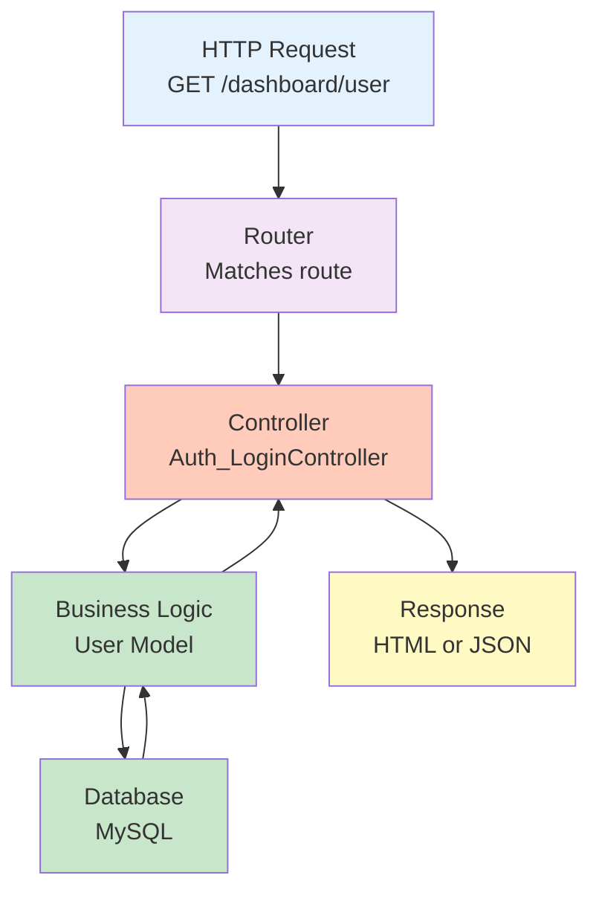

# ReidHub API Reference Documentation

## Table of Contents
1. [Overview](#overview)
2. [API Architecture](#api-architecture)
3. [Authentication Module](#authentication-module)
4. [Dashboard Module](#dashboard-module)
5. [Marketplace Module](#marketplace-module)
6. [Community Module](#community-module)
7. [Forum Module](#forum-module)
8. [Lost & Found Module](#lost--found-module)
9. [Home Module](#home-module)
10. [Response Format Standards](#response-format-standards)
11. [Error Handling](#error-handling)
12. [Future API Endpoints](#future-api-endpoints)

---

## Overview

ReidHub API is organized around **7 main modules**, each responsible for specific functionality. The API supports both **traditional form submissions** and **AJAX/JSON responses** depending on the `Accept` header and request type.

### Key Characteristics
- **MVC-Based Routing**: Routes map to Controller@Action patterns
- **Dual-Mode Responses**: Form rendering (GET) and JSON APIs (POST/GET)
- **Session-Based Authentication**: Uses PHP `$_SESSION` for user/admin tracking
- **RESTful Routes**: Organized by feature and functionality
- **Stateful Operations**: Server-side session management

### API Base URL
```
http://localhost:8000  (Development)
https://reidhub.com    (Production)
```

---

## API Architecture

### Routing Pattern

```
URL Format: /path/to/endpoint
HTTP Method: GET, POST, PUT, DELETE (as defined in routes)
Controller: Module_ControllerName@actionMethod
Response: HTML (GET/traditional form) or JSON (AJAX/API)
```

### Request/Response Flow



### Request Types

**HTML Form Request**:
```php
// Returns rendered HTML view
GET /login
POST /login (with form data)
Content-Type: application/x-www-form-urlencoded
Accept: text/html

// Response: HTML page
```

**AJAX/JSON Request**:
```javascript
// Returns JSON data
POST /dashboard/marketplace/cart/add
Content-Type: application/json
Accept: application/json
X-Requested-With: XMLHttpRequest

// Response: {"ok": true, "data": {...}}
```

---

## Authentication Module

**Module**: `Auth`
**Controllers**: `Auth_LoginController`
**Views**: Auth-specific forms (login, signup, password recovery)

### Endpoints

#### 1. Show Login Form
```
GET /login
```

**Response**: HTML form

**Example**:
```bash
curl http://localhost:8000/login
```

---

#### 2. Login (User or Admin)
```
POST /login
Content-Type: application/x-www-form-urlencoded
```

**Request Parameters**:
```
username: string (email or registration number) [REQUIRED]
password: string (plaintext) [REQUIRED]
```

**Success Response (HTML)**:
```
Status: 303 See Other
Location: /dashboard/user  (for users)
          /dashboard/admin (for admins)
Set-Cookie: PHPSESSID=...
```

**Success Response (AJAX)**:
```json
{
  "ok": true,
  "redirect": "/dashboard/user"
}
```

**Error Response (HTML)**:
```
Status: 200
Body: Login form with error messages
Errors displayed: {"username": "Email/RegNo required", "password": "Password required"}
```

**Error Response (AJAX)**:
```json
{
  "ok": false,
  "errors": {
    "username": "Email or Registration No is required.",
    "password": "Password is required."
  }
}
Status: 422 Unprocessable Entity
```

**Authentication Method**:
- Checks `users` table first by email or registration number
- If no user found, checks `admins` table by email
- Verifies password using `password_verify()` with bcrypt hash
- Creates session with `$_SESSION['user_id']` or `$_SESSION['admin_id']`

**Example**:
```bash
curl -X POST http://localhost:8000/login \
  -d "username=user@example.com&password=mypassword" \
  -c cookies.txt

# Or with AJAX
curl -X POST http://localhost:8000/login \
  -H "Content-Type: application/json" \
  -H "X-Requested-With: XMLHttpRequest" \
  -d '{"username":"user@example.com","password":"mypassword"}'
```

---

#### 3. Show Signup Form
```
GET /signup
```

**Response**: HTML signup form

---

#### 4. Sign Up (User Registration)
```
POST /signup
Content-Type: application/x-www-form-urlencoded
```

**Request Parameters**:
```
first_name: string [REQUIRED]
last_name: string [REQUIRED]
email: string (valid email) [REQUIRED, UNIQUE]
reg_no: string (format: YYYY(is|cs)NNN) [REQUIRED, UNIQUE]
password: string (min 8 chars recommended) [REQUIRED]
confirm_password: string [REQUIRED, must match password]
```

**Success Response**:
```
Status: 303 See Other
Location: /login
Message: "Account created! Please log in."
```

**Error Response**:
```json
{
  "errors": {
    "email": "Email already registered.",
    "reg_no": "Registration number format invalid.",
    "password": "Passwords do not match."
  }
}
```

**Validation**:
- Email uniqueness check against `users` table
- Registration number format: `^\d{4}(is|cs)\d{3}$` (e.g., 2024IS001)
- Password hashed with bcrypt before storage

**Example**:
```bash
curl -X POST http://localhost:8000/signup \
  -d "first_name=John&last_name=Doe&email=john@example.com&reg_no=2024IS001&password=securepass&confirm_password=securepass"
```

---

#### 5. Show Password Recovery Form
```
GET /recoverPassword
```

**Response**: HTML form

---

#### 6. Recover Password
```
POST /recoverPassword
```

**Request Parameters**:
```
email: string [REQUIRED]
```

**Response**: HTML page or JSON with message

---

#### 7. Show Password Reset Form
```
GET /reset-sender
```

**Response**: HTML form

---

#### 8. Show Password Reset (Filled)
```
POST /reset-sender
```

**Request Parameters**:
```
email: string [REQUIRED]
```

**Response**: HTML reset form or email confirmation

---

#### 9. Verify Email
```
POST /verify-email
```

**Request Parameters**:
```
email: string [REQUIRED]
verification_code: string [REQUIRED]
```

**Response**: Verification status

---

#### 10. Logout
```
POST /logout
```

**Response**:
```
Status: 303 See Other
Location: /login
Session destroyed
```

**Example**:
```bash
curl -X POST http://localhost:8000/logout \
  -b cookies.txt
```

---

## Dashboard Module

**Module**: `Dashboard`
**Controllers**: 
- `Dashboard_UserDashboardController`
- `Dashboard_AdminDashboardController`

### User Dashboard

#### 1. Show User Dashboard
```
GET /dashboard/user
```

**Required Session**: `$_SESSION['user_id']` (redirects to /login if not set)

**Response**: HTML dashboard with user's data

**Data Returned**:
```
user: {
  id, first_name, last_name, email, reg_no, created_at, updated_at
}
Orders: Count of recent orders
Cart: Count of items in cart
Transactions: Count of completed transactions
Notifications: Unread messages
```

**Example**:
```bash
curl http://localhost:8000/dashboard/user -b cookies.txt
```

---

### Admin Dashboard

#### 1. Show Admin Dashboard
```
GET /dashboard/admin
```

**Required Session**: `$_SESSION['admin_id']` (redirects to /login if not set)

**Response**: HTML dashboard with admin analytics

**Data Returned**:
```
Total Users
Total Products
Total Orders
Recent Transactions
Platform Statistics
```

---

## Marketplace Module

**Module**: `Marketplace`
**Controllers**: 
- `Marketplace_MarketplaceUserController` (user operations)
- `Marketplace_MarketplaceAdminController` (admin operations)

### User Marketplace Operations

#### 1. Show Merch Store (Browse Products)
```
GET /dashboard/marketplace/merch-store
```

**Required Session**: User logged in

**Query Parameters**:
```
category: string (optional) - 'merchandise' or 'second-hand'
sort: string (optional) - 'price_asc', 'price_desc', 'newest'
page: int (optional) - pagination (default: 1)
```

**Response**: HTML page with product list

**Data Structure**:
```json
{
  "user": { user details },
  "merchandiseItems": [
    {
      "id": 1,
      "title": "Campus Hoodie",
      "price": 499.99,
      "condition": "brand_new",
      "image": "/storage/marketplace/1.webp",
      "stock_quantity": 5,
      "stock_badge_text": "In Stock",
      "product_type": "apparel"
    }
  ],
  "secondHandItems": [...]
}
```

**Example**:
```bash
curl "http://localhost:8000/dashboard/marketplace/merch-store?category=merchandise" \
  -b cookies.txt
```

---

#### 2. Show Specific Product
```
GET /dashboard/marketplace/show-product
```

**Query Parameters**:
```
id: int [REQUIRED] - Product ID
```

**Response**: HTML product detail page

**Data Returned**:
```
Product details: id, title, description, price, images, stock, seller info
Reviews: Seller rating and feedback
Recommendations: Similar products
```

**Example**:
```bash
curl "http://localhost:8000/dashboard/marketplace/show-product?id=123" \
  -b cookies.txt
```

---

#### 3. Add to Cart
```
POST /dashboard/marketplace/cart/add
Content-Type: application/json
```

**Request Body**:
```json
{
  "product_id": 123,
  "quantity": 2
}
```

**Response**:
```json
{
  "ok": true,
  "message": "Added to cart",
  "cart_count": 3,
  "cart_total": 1499.99
}
```

**Error Response**:
```json
{
  "ok": false,
  "error": "Product out of stock",
  "message": "Could not add to cart"
}
```

**Database Operations**:
- Inserts/updates in `cart_items` table
- Uses unique constraint on (user_id, product_id)
- Snapshots unit_price at time of adding

**Example**:
```bash
curl -X POST http://localhost:8000/dashboard/marketplace/cart/add \
  -H "Content-Type: application/json" \
  -d '{"product_id":123,"quantity":2}' \
  -b cookies.txt
```

---

#### 4. Get Cart Items (API)
```
GET /dashboard/marketplace/cart/get
```

**Response**:
```json
{
  "ok": true,
  "items": [
    {
      "id": 1,
      "product_id": 123,
      "product_title": "Campus Hoodie",
      "quantity": 2,
      "unit_price": 499.99,
      "subtotal": 999.98,
      "image": "/storage/marketplace/123.webp"
    }
  ],
  "total": 999.98,
  "item_count": 1
}
```

**Example**:
```bash
curl http://localhost:8000/dashboard/marketplace/cart/get \
  -b cookies.txt
```

---

#### 5. Update Cart Item Quantity
```
POST /dashboard/marketplace/cart/update
Content-Type: application/json
```

**Request Body**:
```json
{
  "cart_item_id": 1,
  "quantity": 5
}
```

**Response**:
```json
{
  "ok": true,
  "message": "Cart updated",
  "new_total": 2499.95,
  "item_count": 1
}
```

**Example**:
```bash
curl -X POST http://localhost:8000/dashboard/marketplace/cart/update \
  -H "Content-Type: application/json" \
  -d '{"cart_item_id":1,"quantity":5}' \
  -b cookies.txt
```

---

#### 6. Remove from Cart
```
POST /dashboard/marketplace/cart/remove
Content-Type: application/json
```

**Request Body**:
```json
{
  "cart_item_id": 1
}
```

**Response**:
```json
{
  "ok": true,
  "message": "Item removed from cart",
  "cart_total": 0,
  "item_count": 0
}
```

**Example**:
```bash
curl -X POST http://localhost:8000/dashboard/marketplace/cart/remove \
  -H "Content-Type: application/json" \
  -d '{"cart_item_id":1}' \
  -b cookies.txt
```

---

#### 7. Show Checkout
```
GET /dashboard/marketplace/checkout
```

**Response**: HTML checkout form

**Data**:
```
Cart items summary
Total amount
Payment method options: cash_on_delivery, preorder
Shipping details form
```

---

#### 8. Submit Checkout (Place Order)
```
POST /dashboard/marketplace/checkout/place-order
Content-Type: application/json
```

**Request Body**:
```json
{
  "payment_method": "cash_on_delivery",
  "delivery_address": "123 Campus Road",
  "phone": "9876543210"
}
```

**Response**:
```json
{
  "ok": true,
  "transaction_id": 456,
  "order_ids": [789, 790, 791],
  "message": "Order placed successfully",
  "redirect": "/dashboard/marketplace/transactions/view?id=456"
}
```

**Operations**:
1. Creates transaction record
2. Creates individual orders for each cart item
3. Clears cart_items for user
4. Sends confirmation email (if implemented)

**Database Changes**:
- `INSERT` into `transactions`
- `INSERT` into `orders` (multiple rows if cart had multiple items)
- `DELETE` from `cart_items`

**Example**:
```bash
curl -X POST http://localhost:8000/dashboard/marketplace/checkout/place-order \
  -H "Content-Type: application/json" \
  -d '{"payment_method":"cash_on_delivery","delivery_address":"123 Campus Road","phone":"9876543210"}' \
  -b cookies.txt
```

---

#### 9. Show My Orders
```
GET /dashboard/marketplace/orders
```

**Response**: HTML orders list page

---

#### 10. Get Orders (API)
```
GET /dashboard/marketplace/orders/get
```

**Query Parameters**:
```
status: string (optional) - 'yet_to_ship', 'delivered', 'cancelled'
page: int (optional)
per_page: int (optional)
```

**Response**:
```json
{
  "ok": true,
  "orders": [
    {
      "id": 789,
      "product_title": "Campus Hoodie",
      "seller_name": "John Doe",
      "quantity": 2,
      "total_price": 999.98,
      "status": "yet_to_ship",
      "payment_method": "cash_on_delivery",
      "created_at": "2026-01-28 10:30:00"
    }
  ],
  "total_count": 5,
  "page": 1,
  "per_page": 10
}
```

---

### Seller Operations

#### 1. Show Add Items Form
```
GET /dashboard/marketplace/seller/add
```

**Response**: HTML form to add product

---

#### 2. Add Product
```
POST /dashboard/marketplace/seller/add
Content-Type: multipart/form-data
```

**Request Fields**:
```
title: string [REQUIRED]
description: string [OPTIONAL]
price: float [REQUIRED]
category: enum [REQUIRED] - 'merchandise', 'second-hand'
product_type: enum [REQUIRED] - 'apparel', 'accessories', 'stationery', 'electronics', 'books', 'other'
condition_type: enum [REQUIRED] - 'brand_new', 'used'
stock_quantity: int [REQUIRED]
payment_methods: array [REQUIRED] - ['cash_on_delivery', 'preorder']
images: file[] [REQUIRED] - multiple image uploads
bank_name: string [IF preorder]
bank_branch: string [IF preorder]
account_name: string [IF preorder]
account_number: string [IF preorder]
```

**Response**:
```json
{
  "ok": true,
  "product_id": 456,
  "message": "Product added successfully",
  "redirect": "/dashboard/marketplace/seller/active"
}
```

**File Uploads**:
- Images stored in `/storage/marketplace/[seller_id]/`
- Converted to WebP format
- Multiple images stored as JSON array in `images` column

---

#### 3. Show Active Products
```
GET /dashboard/marketplace/seller/active
```

**Response**: HTML list of seller's active products

---

#### 4. Get Active Products (API)
```
GET /dashboard/marketplace/seller/active/get
```

**Response**:
```json
{
  "ok": true,
  "products": [
    {
      "id": 456,
      "title": "Campus Hoodie",
      "price": 499.99,
      "stock_quantity": 5,
      "status": "active",
      "views": 120,
      "image": "/storage/marketplace/1/1.webp"
    }
  ]
}
```

---

#### 5. Archive Product
```
POST /dashboard/marketplace/seller/active/archive
Content-Type: application/json
```

**Request Body**:
```json
{
  "product_id": 456
}
```

**Response**:
```json
{
  "ok": true,
  "message": "Product archived"
}
```

**Database Update**:
```sql
UPDATE products SET status = 'archived' WHERE id = 456
```

---

#### 6. Show Archived Products
```
GET /dashboard/marketplace/seller/archived
```

**Response**: HTML list of archived products

---

#### 7. Unarchive Product
```
POST /dashboard/marketplace/seller/archived/update
Content-Type: application/json
```

**Request Body**:
```json
{
  "product_id": 456,
  "action": "unarchive"
}
```

**Response**:
```json
{
  "ok": true,
  "message": "Product restored"
}
```

---

#### 8. Show Edit Products
```
GET /dashboard/marketplace/seller/edit
```

**Query Parameters**:
```
id: int [OPTIONAL] - Product ID to edit
```

**Response**: HTML edit form or product list

---

#### 9. Update Product
```
POST /dashboard/marketplace/seller/edit
Content-Type: multipart/form-data
```

**Request Fields**: Same as add product

**Response**:
```json
{
  "ok": true,
  "message": "Product updated",
  "redirect": "/dashboard/marketplace/seller/active"
}
```

---

#### 10. Show Seller Orders
```
GET /dashboard/marketplace/seller/orders
```

**Response**: HTML orders page for seller

---

#### 11. Get Seller Orders (API)
```
GET /dashboard/marketplace/seller/orders/get
```

**Query Parameters**:
```
status: string (optional) - 'yet_to_ship', 'delivered', 'cancelled'
```

**Response**:
```json
{
  "ok": true,
  "orders": [
    {
      "id": 789,
      "buyer_name": "Jane Smith",
      "product_title": "Campus Hoodie",
      "quantity": 2,
      "total_price": 999.98,
      "status": "yet_to_ship",
      "payment_method": "cash_on_delivery",
      "created_at": "2026-01-28 10:30:00"
    }
  ]
}
```

---

#### 12. Mark Order as Delivered
```
POST /dashboard/marketplace/seller/orders/mark-delivered
Content-Type: application/json
```

**Request Body**:
```json
{
  "order_id": 789
}
```

**Response**:
```json
{
  "ok": true,
  "message": "Order marked as delivered"
}
```

**Database Update**:
```sql
UPDATE orders SET status = 'delivered', updated_at = NOW() WHERE id = 789
```

---

#### 13. Cancel Order
```
POST /dashboard/marketplace/seller/orders/cancel
Content-Type: application/json
```

**Request Body**:
```json
{
  "order_id": 789,
  "reason": "Out of stock"
}
```

**Response**:
```json
{
  "ok": true,
  "message": "Order cancelled"
}
```

---

#### 14. Show Seller Analytics
```
GET /dashboard/marketplace/seller/analytics
```

**Response**: HTML analytics dashboard

---

#### 15. Get Seller Analytics Data (API)
```
GET /dashboard/marketplace/seller/analytics/data
```

**Query Parameters**:
```
period: string (optional) - 'week', 'month', 'year'
```

**Response**:
```json
{
  "ok": true,
  "total_sales": 50000,
  "total_orders": 125,
  "total_products": 45,
  "active_products": 40,
  "average_rating": 4.5,
  "chart_data": {
    "sales_by_day": [...],
    "products_by_category": [...]
  }
}
```

---

#### 16. Show Transactions
```
GET /dashboard/marketplace/transactions
```

**Response**: HTML transactions history page

---

#### 17. Get Transactions (API)
```
GET /dashboard/marketplace/transactions/data
```

**Query Parameters**:
```
page: int (optional)
per_page: int (optional)
start_date: string (optional) - YYYY-MM-DD
end_date: string (optional) - YYYY-MM-DD
```

**Response**:
```json
{
  "ok": true,
  "transactions": [
    {
      "id": 456,
      "total_amount": 1999.96,
      "item_count": 2,
      "created_at": "2026-01-28 10:30:00",
      "orders_count": 2,
      "status": "delivered"
    }
  ]
}
```

---

#### 18. View Transaction Details
```
GET /dashboard/marketplace/transactions/view
```

**Query Parameters**:
```
id: int [REQUIRED] - Transaction ID
```

**Response**: HTML transaction details page

---

#### 19. Download Invoice
```
GET /dashboard/marketplace/transactions/invoice
```

**Query Parameters**:
```
id: int [REQUIRED] - Transaction ID
```

**Response**: PDF invoice file (application/pdf)

---

### Admin Marketplace Operations

#### 1. Show Admin Marketplace Analytics
```
GET /dashboard/marketplace/admin/analytics
```

**Response**: HTML admin analytics dashboard with platform-wide metrics

---

#### 2. Show Reported Items
```
GET /dashboard/marketplace/admin/reported
```

**Response**: HTML list of reported/flagged products

---

#### 3. Show Archived Items (Admin View)
```
GET /dashboard/marketplace/admin/archived
```

**Response**: HTML list of all archived items on platform

---

## Community Module

**Module**: `Community`
**Controllers**: 
- `Community_CommunityUserController` (user operations)
- `Community_CommunityAdminController` (admin operations)

### Blogs

#### 1. Show All Blogs
```
GET /dashboard/community/blogs
```

**Query Parameters**:
```
page: int (optional)
search: string (optional)
tag: string (optional)
```

**Response**: HTML blogs list

---

#### 2. Show Blog Details
```
GET /dashboard/community/blogs/view
```

**Query Parameters**:
```
id: int [REQUIRED] - Blog ID
```

**Response**: HTML blog detail page

---

#### 3. Show Create Blog Form
```
GET /dashboard/community/blogs/create
```

**Response**: HTML blog creation form

---

#### 4. Create Blog
```
POST /dashboard/community/blogs/create
Content-Type: application/x-www-form-urlencoded
```

**Request Fields**:
```
title: string [REQUIRED]
content: text [REQUIRED]
tags: string (comma-separated) [OPTIONAL]
featured_image: file [OPTIONAL]
```

**Response**:
```json
{
  "ok": true,
  "blog_id": 789,
  "redirect": "/dashboard/community/blogs/view?id=789"
}
```

---

#### 5. Show Edit Blog Form
```
GET /dashboard/community/blogs/edit
```

**Query Parameters**:
```
id: int [REQUIRED]
```

**Response**: HTML edit form

---

#### 6. Update Blog
```
POST /dashboard/community/blogs/edit
Content-Type: application/x-www-form-urlencoded
```

**Response**:
```json
{
  "ok": true,
  "message": "Blog updated"
}
```

---

### Clubs

#### 1. Show All Clubs
```
GET /dashboard/community/clubs
```

**Response**: HTML clubs list

---

#### 2. Show Club Details
```
GET /dashboard/community/clubs/view
```

**Query Parameters**:
```
id: int [REQUIRED]
```

**Response**: HTML club detail page

---

#### 3. Show Create Club Form
```
GET /dashboard/community/clubs/create
```

**Response**: HTML club creation form

---

#### 4. Create Club
```
POST /dashboard/community/clubs/create
Content-Type: multipart/form-data
```

**Request Fields**:
```
name: string [REQUIRED]
description: text [REQUIRED]
category: string [OPTIONAL]
logo: file [OPTIONAL]
cover_image: file [OPTIONAL]
```

**Response**:
```json
{
  "ok": true,
  "club_id": 123
}
```

---

#### 5. Show Edit Club Form
```
GET /dashboard/community/clubs/edit
```

**Query Parameters**:
```
id: int [REQUIRED]
```

**Response**: HTML edit form

---

#### 6. Update Club
```
POST /dashboard/community/clubs/edit
Content-Type: multipart/form-data
```

**Response**:
```json
{
  "ok": true,
  "message": "Club updated"
}
```

---

### Events

#### 1. Show All Events
```
GET /dashboard/community/events
```

**Query Parameters**:
```
page: int (optional)
category: string (optional)
date: string (optional) - YYYY-MM-DD
```

**Response**: HTML events list

---

#### 2. Show Event Details
```
GET /dashboard/community/events/view
```

**Query Parameters**:
```
id: int [REQUIRED]
```

**Response**: HTML event detail page

---

#### 3. Show Create Event Form
```
GET /dashboard/community/events/create
```

**Response**: HTML event creation form

---

#### 4. Create Event
```
POST /dashboard/community/events/create
Content-Type: multipart/form-data
```

**Request Fields**:
```
title: string [REQUIRED]
description: text [REQUIRED]
event_date: datetime [REQUIRED]
location: string [REQUIRED]
category: string [OPTIONAL]
max_attendees: int [OPTIONAL]
banner_image: file [OPTIONAL]
```

**Response**:
```json
{
  "ok": true,
  "event_id": 456
}
```

---

#### 5. Show Edit Event Form
```
GET /dashboard/community/events/edit
```

**Query Parameters**:
```
id: int [REQUIRED]
```

**Response**: HTML edit form

---

#### 6. Update Event
```
POST /dashboard/community/events/edit
Content-Type: multipart/form-data
```

**Response**:
```json
{
  "ok": true,
  "message": "Event updated"
}
```

---

## Forum Module

**Module**: `Forum`
**Controllers**: 
- `Forum_ForumUserController` (user operations)
- `Forum_ForumAdminController` (admin operations)

### Endpoints

#### 1. Show All Questions
```
GET /dashboard/forum/all
```

**Query Parameters**:
```
page: int (optional)
search: string (optional)
sort: string (optional) - 'newest', 'popular', 'unanswered'
```

**Response**: HTML questions list

---

#### 2. Show Question Details
```
GET /dashboard/forum/question
```

**Query Parameters**:
```
id: int [REQUIRED]
```

**Response**: HTML question detail page with answers

---

#### 3. Show Add Question Form
```
GET /dashboard/forum/add
```

**Response**: HTML question creation form

---

#### 4. Create Question
```
POST /dashboard/forum/add
Content-Type: application/x-www-form-urlencoded
```

**Request Fields**:
```
title: string [REQUIRED]
content: text [REQUIRED]
tags: string (comma-separated) [OPTIONAL]
```

**Response**:
```json
{
  "ok": true,
  "question_id": 789,
  "redirect": "/dashboard/forum/question?id=789"
}
```

---

#### 5. Show Forum Admin Dashboard
```
GET /dashboard/forum/admin
```

**Required Session**: Admin user

**Response**: HTML admin dashboard for forum moderation

---

## Lost & Found Module

**Module**: `LostAndFound`
**Controllers**: `LostAndFound_LostAndFoundUserController`

### Endpoints

#### 1. Show Report Lost Item Form
```
GET /dashboard/lost-and-found/report-lost-item
```

**Response**: HTML form

---

#### 2. Report Lost Item
```
POST /dashboard/lost-and-found/report-lost-item
Content-Type: multipart/form-data
```

**Request Fields**:
```
item_name: string [REQUIRED]
description: text [REQUIRED]
location: string [REQUIRED]
date_lost: date [REQUIRED]
images: file[] [OPTIONAL]
contact_number: string [OPTIONAL]
```

**Response**:
```json
{
  "ok": true,
  "item_id": 123,
  "message": "Lost item reported successfully"
}
```

---

#### 3. Show Report Found Item Form
```
GET /dashboard/lost-and-found/report-found-item
```

**Response**: HTML form

---

#### 4. Report Found Item
```
POST /dashboard/lost-and-found/report-found-item
Content-Type: multipart/form-data
```

**Request Fields**:
```
item_name: string [REQUIRED]
description: text [REQUIRED]
location: string [REQUIRED]
date_found: date [REQUIRED]
images: file[] [OPTIONAL]
contact_number: string [OPTIONAL]
```

**Response**:
```json
{
  "ok": true,
  "item_id": 124
}
```

---

#### 5. Show Lost & Found Items
```
GET /dashboard/lost-and-found/items
```

**Query Parameters**:
```
type: string (optional) - 'lost', 'found', 'all'
page: int (optional)
search: string (optional)
```

**Response**: HTML items list

---

#### 6. Show Community Admin Dashboard
```
GET /dashboard/community/admin
```

**Response**: HTML admin dashboard for community management

---

#### 7. Manage Lost & Found (Admin)
```
GET /dashboard/lost-and-found/admin
```

**Response**: HTML admin management page

---

## Home Module

**Module**: `Home`
**Controllers**: `Home_HomeController`

### Endpoints

#### 1. Show Home Page
```
GET /
```

**Response**: HTML landing/home page

**Public Content**:
- Hero section
- Features overview
- About section
- Getting started guide
- Call-to-action for login/signup

**Example**:
```bash
curl http://localhost:8000/
```

---

## Response Format Standards

### Standard JSON Response (Success)

```json
{
  "ok": true,
  "data": {
    /* Response data */
  },
  "message": "Operation successful"
}
```

### Standard JSON Response (Error)

```json
{
  "ok": false,
  "error": "error_code",
  "message": "Human-readable error message",
  "errors": {
    "field_name": "Field-specific error message"
  }
}
```

### Pagination Response

```json
{
  "ok": true,
  "data": [...],
  "pagination": {
    "current_page": 1,
    "per_page": 20,
    "total": 100,
    "last_page": 5
  }
}
```

---

## Error Handling

### HTTP Status Codes

| Code | Meaning | Use Case |
|------|---------|----------|
| 200 | OK | Successful request |
| 303 | See Other | Redirect after form submission |
| 400 | Bad Request | Invalid parameters |
| 401 | Unauthorized | Not authenticated |
| 403 | Forbidden | No permission |
| 404 | Not Found | Resource not found |
| 422 | Unprocessable Entity | Validation errors |
| 500 | Internal Server Error | Server error |

### Error Response Examples

**Authentication Error**:
```json
{
  "ok": false,
  "error": "unauthenticated",
  "message": "Please log in to continue"
}
Status: 401
```

**Validation Error**:
```json
{
  "ok": false,
  "error": "validation_failed",
  "errors": {
    "email": "Invalid email format",
    "password": "Password must be at least 8 characters"
  }
}
Status: 422
```

**Resource Not Found**:
```json
{
  "ok": false,
  "error": "not_found",
  "message": "Product not found"
}
Status: 404
```

---

## Future API Endpoints

### Planned for Phase 2 (Q1 2026)

#### User Profiles
```
GET /api/users/{id}/profile
POST /api/users/{id}/profile/update
GET /api/users/{id}/followers
POST /api/users/{id}/follow
```

#### Notifications
```
GET /api/notifications
POST /api/notifications/{id}/read
DELETE /api/notifications/{id}
WebSocket: /ws/notifications
```

#### Search
```
GET /api/search
GET /api/search/products
GET /api/search/users
GET /api/search/blogs
```

#### Reviews & Ratings
```
GET /api/products/{id}/reviews
POST /api/products/{id}/reviews
GET /api/sellers/{id}/rating
```

#### Social Features
```
POST /api/comments/{id}/like
POST /api/posts/{id}/like
POST /api/users/{id}/message
```

#### Analytics
```
GET /api/analytics/dashboard
GET /api/analytics/sales
GET /api/analytics/users
GET /api/analytics/exports
```

---

## Summary

ReidHub API is organized into **7 main modules** with clear routing patterns and consistent response formats. The API supports:
- **Multiple response types** (HTML and JSON)
- **Dual-mode operations** (traditional forms and AJAX)
- **Session-based authentication**
- **Scalable endpoint structure** for future modules

All endpoints include:
- Clear parameter documentation
- Request/response examples
- Error handling specifications
- Database operations detail
- Usage examples with curl

As the platform grows with new modules (Comments, Messaging, Notifications, Reviews), follow the established patterns for consistency.
