# ReidHub Architecture Documentation

## Table of Contents
1. [System Overview](#system-overview)
2. [High-Level Architecture](#high-level-architecture)
3. [MVC Framework Design](#mvc-framework-design)
4. [Request Lifecycle](#request-lifecycle)
5. [Module Organization](#module-organization)
6. [Core Components](#core-components)
7. [Design Patterns](#design-patterns)
---

## System Overview

**ReidHub** is a custom-built PHP MVC (Model-View-Controller) platform designed as an all-in-one campus community hub. It provides marketplace functionality, academic resource sharing, community engagement tools, and a lost & found system without relying on external frameworks like Laravel or Symfony.

### Key Characteristics
- **Lightweight Custom Framework**: Minimal dependencies, full control over architecture
- **Modular Design**: Feature-based module organization (Marketplace, Community, Forum, etc.)
- **Database-Driven**: MySQL backend with PDO for database abstraction
- **Session-Based Authentication**: User and Admin roles with session management
- **Multi-Role Support**: User and Admin dashboards with role-specific access

---

## High-Level Architecture

```mermaid
graph TB
    Client["👤 Client<br/>(Browser)"]
    Nginx["🌐 Nginx<br/>(Web Server)"]
    PHP["⚙️ PHP-FPM<br/>(Application Server)"]
    Router["🔀 Router<br/>(Request Dispatcher)"]
    Controller["🎮 Controllers<br/>(Request Handlers)"]
    Model["💾 Models<br/>(Data Layer)"]
    DB["🗄️ MySQL Database"]
    View["👁️ Views<br/>(Templates)"]
    Assets["📦 Static Assets<br/>(CSS/JS/Images)"]
    
    Client -->|HTTP Request| Nginx
    Nginx -->|Forward| PHP
    PHP -->|Parse & Route| Router
    Router -->|Dispatch to| Controller
    Controller -->|Query/Update| Model
    Model -->|Execute SQL| DB
    DB -->|Return Data| Model
    Model -->|Pass Data| Controller
    Controller -->|Render| View
    View -->|HTML Response| Client
    Client -->|Request| Assets
    Nginx -->|Serve| Assets
    
    style Client fill:#e1f5ff
    style Nginx fill:#fff3e0
    style PHP fill:#fff3e0
    style Router fill:#f3e5f5
    style Controller fill:#f3e5f5
    style Model fill:#e8f5e9
    style DB fill:#e8f5e9
    style View fill:#fce4ec
    style Assets fill:#fce4ec
```



---

## MVC Framework Design

ReidHub implements a custom, lightweight MVC pattern with the following structure:


### Framework Components

| Component | Location | Purpose |
|-----------|----------|---------|
| **Entry Point** | `public/index.php` | Initializes application, registers autoloader, starts routing |
| **Router** | `app/core/Router.php` | Matches HTTP requests to controller actions |
| **Controller** | `app/core/Controller.php` | Base class for all controllers, handles views |
| **Model** | `app/core/Model.php` | Base class for data models, database abstraction |
| **Database** | `app/core/Database.php` | Singleton database connection management (PDO) |
| **View** | `app/core/View.php` | Template rendering engine |
| **Logger** | `app/core/Logger.php` | Application logging to `storage/logs/` |

---

## Request Lifecycle

The complete flow of a user request through the ReidHub application:


### Key Points in Lifecycle:

1. **Autoloading** (Lines 12-27 in `public/index.php`):
   - Automatically loads classes from `app/core/`, `app/controllers/`, `app/models/`
   - Uses namespace-like naming (e.g., `Auth_LoginController` maps to `Auth/LoginController.php`)

2. **Routing** (Router.php):
   - Routes defined as `$routes[URI][METHOD] = 'Controller@Action'`
   - Converts underscores to directory separators: `Auth_LoginController` → `Auth/LoginController.php`

3. **Controller Instantiation**:
   - Dynamic instantiation based on matched route
   - Calls specified action method (e.g., `login()`, `showLoginForm()`)

4. **View Rendering**:
   - Two methods: `view()` for standalone pages, `viewApp()` for layout-wrapped pages
   - Uses `extract()` to convert data array into variables

---

## Module Organization

ReidHub is organized into **7 feature modules**, each with its own controllers and views:


### Module Details

| Module | Purpose | Controllers | User Types |
|--------|---------|-------------|-----------|
| **Auth** | User authentication & account management | LoginController | All |
| **Dashboard** | User and admin dashboards | AdminDashboardController, UserDashboardController | Admin, User |
| **Marketplace** | Buy/sell items, cart, orders | MarketplaceAdminController, MarketplaceUserController | Admin, User |
| **Community** | Community management & engagement | CommunityAdminController, CommunityUserController | Admin, User |
| **Forum** | Academic discussion forum | ForumAdminController, ForumUserController | Admin, User |
| **Lost & Found** | Report and browse lost/found items | LostAndFoundUserController | User |
| **Home** | Public-facing landing page | HomeController | All |

---

## Core Components

### 1. Router Class (`app/core/Router.php`)

**Responsibility**: Dispatch HTTP requests to appropriate controller actions

**Key Methods**:
- `__construct($routes)` - Initialize with routes array
- `dispatch($uri, $method)` - Match request and call controller action

**Route Format**:
```php
$routes['/path/to/resource'] = [
    'GET' => 'Module_ControllerName@actionMethod',
    'POST' => 'Module_ControllerName@actionMethod'
];
```

**Naming Convention**:
- Underscores represent directory separators
- `Auth_LoginController` → `app/controllers/Auth/LoginController.php`
- Class name must match directory structure

### 2. Controller Class (`app/core/Controller.php`)

**Responsibility**: Handle request logic and view rendering

**Key Methods**:
- `view($view, $data = [])` - Render standalone view (for auth pages)
- `viewApp($view, $data = [], $title = 'ReidHub')` - Render view within layout (for app pages)

**Usage Pattern**:
```php
class UserDashboardController extends Controller {
    public function showUserDashboard() {
        $data = ['user' => $user, 'orders' => $orders];
        $this->viewApp('User/user-dashboard-view', $data, 'My Dashboard');
    }
}
```

### 3. Model Class (`app/core/Model.php`)

**Responsibility**: Provide database abstraction for data operations

**Key Features**:
- Extends with database query methods
- Uses PDO for prepared statements (SQL injection protection)
- Returns associative arrays or objects

**Example Models**:
- `User.php` - User account management
- `Cart.php` - Shopping cart operations
- `Order.php` - Order management
- `Transaction.php` - Payment records
- `MarketPlace.php` - Product listings

### 4. Database Class (`app/core/Database.php`)

**Responsibility**: Singleton database connection management

**Key Features**:
- Single connection instance (singleton pattern)
- PDO wrapper for MySQL
- Configuration from `app/config/config.php`

**Connection Details**:
```
Host: db (Docker service name)
Database: reidhub
Port: 3306
User: from config.php
Password: from config.php
```

### 5. View System

**Two Rendering Methods**:

#### a. `view()` - Standalone Views
Used for pages without layout (login, signup, etc.)
```
Request → Controller → view() → Renders: views/Auth/log-in-view.php → Response
```

#### b. `viewApp()` - Layout-Wrapped Views
Used for authenticated app pages with sidebar and header
```
Request → Controller → viewApp() → Renders: layout.php with sidebar + header + content → Response
```

**View Structure**:
```
views/
├── layout.php           (Main app layout with components)
├── components/
│   ├── header.php       (Top navigation)
│   ├── sidebar.php      (Left navigation)
├── Auth/                (Authentication views)
├── Home/                (Public views)
├── Admin/               (Admin dashboard & features)
└── User/                (User dashboard & features)
    ├── community/
    ├── edu-forum/
    ├── lost-and-found/
    └── marketplace/
```

### 6. Logger Class (`app/core/Logger.php`)

**Responsibility**: Application logging for debugging and monitoring

**Log Levels**:
- `info()` - Informational messages
- `error()` - Error messages
- `warning()` - Warning messages

**Log Location**: `storage/logs/` (created at runtime)

---

## Design Patterns

### 1. **Singleton Pattern** (Database Connection)
```
Database.php maintains a single global connection instance
↓
All Models use the same database connection
↓
Avoids multiple connections to MySQL
```

### 2. **MVC Pattern**
```
Models (Data) ← → Controllers (Logic) ← → Views (Presentation)
```

### 3. **Route-to-Action Dispatch Pattern**
```
URI + HTTP Method → Router → Controller → Action Method
```

### 4. **Template Rendering with Extract**
```php
extract($data);  // Convert array to variables
require_once $viewFile;  // Access variables in template
```

### 5. **SPL Autoloading Pattern**
```
spl_autoload_register() → Auto-loads classes from standard paths
Avoids manual require_once for each class
```

---

## Security Architecture

### Authentication
- Session-based using PHP `$_SESSION`
- Password hashing with bcrypt
- Email verification for new accounts

### Authorization
- Role-based access control (User vs Admin)
- Session validation on protected routes
- User/Admin specific controllers

### Data Protection
- PDO prepared statements prevent SQL injection
- Input validation in controllers
- HTTPS enforced (via Nginx configuration)

### Logging & Monitoring
- All requests logged with URI and method
- Error logging for debugging
- Application events tracked in `storage/logs/`

---
