# ReidHub Database Schema Documentation

## Table of Contents
1. [Overview](#overview)
2. [Entity Relationship Diagram](#entity-relationship-diagram)
3. [Core Tables](#core-tables)
4. [Marketplace Tables](#marketplace-tables)
5. [Table Specifications](#table-specifications)
6. [Indexes & Performance](#indexes--performance)
7. [Constraints & Validation](#constraints--validation)
8. [Data Types & Storage](#data-types--storage)
9. [Future Schema Extensions](#future-schema-extensions)
10. [Database Maintenance](#database-maintenance)

---

## Overview

ReidHub uses a **MySQL relational database** to store all application data. The schema is organized into two main categories:

### Core Infrastructure Tables
- **users** - Campus user accounts
- **admins** - Platform administrator accounts

### Feature-Specific Tables
- **products** - Marketplace items (merchandise and second-hand)
- **cart_items** - Shopping cart items
- **transactions** - Transaction records for orders
- **orders** - Individual order details with payment tracking

### Database Details
- **Database Name**: `reidhub`
- **Charset**: UTF-8MB4 (supports emojis and special characters)
- **Engine**: InnoDB (supports transactions and foreign keys)
- **Connection**: PDO with prepared statements

---

## Entity Relationship Diagram

### Current Schema (as of January 2026)


### Data Flow Diagram

```mermaid
graph TD
    User["👤 User<br/>(Campus Account)"]
    Browse["🛍️ Browse Products"]
    AddCart["➕ Add to Cart<br/>(cart_items)"]
    Cart["🛒 Shopping Cart"]
    Checkout["💳 Checkout"]
    CreateTx["📝 Create Transaction<br/>(transactions)"]
    CreateOrder["📦 Create Order<br/>(orders)"]
    Payment["💰 Process Payment"]
    Confirmation["✅ Order Confirmation"]
    
    User -->|Signup/Login| Browse
    Browse -->|View Products| Browse
    Browse -->|Add to Cart| AddCart
    AddCart -->|Update| Cart
    User -->|Proceed| Checkout
    Checkout -->|Create| CreateTx
    CreateTx -->|Create Records| CreateOrder
    CreateOrder -->|Pay| Payment
    Payment -->|Record| CreateOrder
    CreateOrder -->|Send| Confirmation
    
    style User fill:#e3f2fd
    style Browse fill:#b2dfdb
    style AddCart fill:#c8e6c9
    style Cart fill:#fff9c4
    style Checkout fill:#ffe0b2
    style CreateTx fill:#f0f4c3
    style CreateOrder fill:#f0f4c3
    style Payment fill:#ffccbc
    style Confirmation fill:#c8e6c9
```



---

## Core Tables

### 1. Users Table

**Purpose**: Store campus user account information

**SQL Definition**:
```sql
CREATE TABLE IF NOT EXISTS users (
  id BIGINT UNSIGNED AUTO_INCREMENT PRIMARY KEY,
  first_name VARCHAR(100) NOT NULL,
  last_name  VARCHAR(100) NOT NULL,
  email      VARCHAR(255) NOT NULL,
  reg_no     VARCHAR(32)  NOT NULL,
  password   VARCHAR(255) NOT NULL,
  created_at DATETIME NOT NULL DEFAULT CURRENT_TIMESTAMP,
  updated_at DATETIME NOT NULL DEFAULT CURRENT_TIMESTAMP ON UPDATE CURRENT_TIMESTAMP,
  CONSTRAINT users_email_unique UNIQUE (email),
  CONSTRAINT users_reg_no_unique UNIQUE (reg_no),
  CONSTRAINT users_regno_chk CHECK (reg_no REGEXP '^[0-9]{4}(is|cs)[0-9]{3}$')
)
```

**Column Specifications**:

| Column | Type | Constraints | Description |
|--------|------|-------------|-------------|
| **id** | BIGINT UNSIGNED | PRIMARY KEY, AUTO_INCREMENT | Unique user identifier |
| **first_name** | VARCHAR(100) | NOT NULL | User's first name |
| **last_name** | VARCHAR(100) | NOT NULL | User's last name |
| **email** | VARCHAR(255) | NOT NULL, UNIQUE | User's email (unique identifier) |
| **reg_no** | VARCHAR(32) | NOT NULL, UNIQUE, PATTERN | Campus registration number (e.g., 2024IS001) |
| **password** | VARCHAR(255) | NOT NULL | Bcrypt hashed password |
| **created_at** | DATETIME | DEFAULT CURRENT_TIMESTAMP | Account creation timestamp |
| **updated_at** | DATETIME | DEFAULT CURRENT_TIMESTAMP ON UPDATE | Last update timestamp |

**Registration Number Pattern**:
```
Pattern: ^[0-9]{4}(is|cs)[0-9]{3}$
Example: 2024IS001, 2023CS042
Format:  [YEAR][BRANCH][NUMBER]
         4 digits, 2 letter branch, 3 digits
```

**Relationships**:
- Sells products (one-to-many with `products`)
- Owns cart items (one-to-many with `cart_items`)
- Initiates transactions (one-to-many with `transactions`)
- Participates in orders (one-to-many with `orders`)

---

### 2. Admins Table

**Purpose**: Store platform administrator account information

**SQL Definition**:
```sql
CREATE TABLE IF NOT EXISTS admins (
  id BIGINT UNSIGNED AUTO_INCREMENT PRIMARY KEY,
  email      VARCHAR(255) NOT NULL UNIQUE,
  password   VARCHAR(255) NOT NULL,
  created_at DATETIME NOT NULL DEFAULT CURRENT_TIMESTAMP,
  updated_at DATETIME NOT NULL DEFAULT CURRENT_TIMESTAMP ON UPDATE CURRENT_TIMESTAMP
)
```

**Column Specifications**:

| Column | Type | Constraints | Description |
|--------|------|-------------|-------------|
| **id** | BIGINT UNSIGNED | PRIMARY KEY, AUTO_INCREMENT | Unique admin identifier |
| **email** | VARCHAR(255) | NOT NULL, UNIQUE | Admin email (login credential) |
| **password** | VARCHAR(255) | NOT NULL | Bcrypt hashed password |
| **created_at** | DATETIME | DEFAULT CURRENT_TIMESTAMP | Account creation timestamp |
| **updated_at** | DATETIME | DEFAULT CURRENT_TIMESTAMP ON UPDATE | Last update timestamp |

**Default Admin**:
```
Email: admin@reidhub.com
Password: admin123 (change in production!)
```

**Future Enhancements**:
- Add `role` column for fine-grained permissions (Super Admin, Moderator, etc.)
- Add `permissions` JSON column for ACL
- Add `last_login` timestamp
- Add `status` (active/inactive) column

---

## Marketplace Tables

### 3. Products Table

**Purpose**: Store marketplace items (merchandise and second-hand goods)

**SQL Definition**:
```sql
CREATE TABLE IF NOT EXISTS products (
    id BIGINT UNSIGNED AUTO_INCREMENT PRIMARY KEY,
    seller_id BIGINT UNSIGNED NOT NULL,
    title VARCHAR(255) NOT NULL,
    description TEXT,
    price DECIMAL(10, 2) NOT NULL,
    category ENUM('merchandise', 'second-hand') NOT NULL,
    product_type ENUM('apparel', 'accessories', 'stationery', 'electronics', 'books', 'other') NOT NULL,
    condition_type ENUM('brand_new', 'used') NOT NULL,
    stock_quantity INT NOT NULL DEFAULT 1,
    status ENUM('active', 'archived') NOT NULL DEFAULT 'active',
    payment_methods JSON,
    images JSON,
    bank_name VARCHAR(100),
    bank_branch VARCHAR(100),
    account_name VARCHAR(255),
    account_number VARCHAR(50),
    created_at DATETIME NOT NULL DEFAULT CURRENT_TIMESTAMP,
    updated_at DATETIME NOT NULL DEFAULT CURRENT_TIMESTAMP ON UPDATE CURRENT_TIMESTAMP,
    FOREIGN KEY (seller_id) REFERENCES users(id) ON DELETE CASCADE,
    INDEX idx_category (category),
    INDEX idx_product_type (product_type),
    INDEX idx_condition (condition_type),
    INDEX idx_status (status),
    INDEX idx_seller (seller_id)
)
```

**Column Specifications**:

| Column | Type | Constraints | Description |
|--------|------|-------------|-------------|
| **id** | BIGINT UNSIGNED | PRIMARY KEY, AUTO_INCREMENT | Unique product identifier |
| **seller_id** | BIGINT UNSIGNED | NOT NULL, FK (users) | User selling the product |
| **title** | VARCHAR(255) | NOT NULL | Product name |
| **description** | TEXT | NULL | Detailed product description |
| **price** | DECIMAL(10,2) | NOT NULL | Price in rupees (supports 2 decimals) |
| **category** | ENUM | NOT NULL | Category: merchandise, second-hand |
| **product_type** | ENUM | NOT NULL | Type: apparel, accessories, stationery, electronics, books, other |
| **condition_type** | ENUM | NOT NULL | Condition: brand_new, used |
| **stock_quantity** | INT | NOT NULL, DEFAULT 1 | Available quantity |
| **status** | ENUM | NOT NULL, DEFAULT 'active' | Status: active, archived |
| **payment_methods** | JSON | NULL | Accepted payments: ["cash_on_delivery", "preorder"] |
| **images** | JSON | NULL | Array of image URLs |
| **bank_name** | VARCHAR(100) | NULL | Seller's bank name (for preorder payments) |
| **bank_branch** | VARCHAR(100) | NULL | Bank branch name |
| **account_name** | VARCHAR(255) | NULL | Account holder name |
| **account_number** | VARCHAR(50) | NULL | Bank account number |
| **created_at** | DATETIME | DEFAULT CURRENT_TIMESTAMP | Listing creation time |
| **updated_at** | DATETIME | DEFAULT ON UPDATE | Last edit time |

**Supported Categories & Types**:
```
Category:
  - merchandise: Official campus merchandise
  - second-hand: Used items from students

Product Types:
  - apparel: Shirts, hoodies, etc.
  - accessories: Bags, belts, etc.
  - stationery: Notebooks, pens, etc.
  - electronics: Phones, laptops, etc.
  - books: Textbooks, novels, etc.
  - other: Miscellaneous items

Condition:
  - brand_new: Unused items
  - used: Previously owned items

Payment Methods (JSON format):
  ["cash_on_delivery", "preorder"]
```

**Payment Flows**:
1. **Cash on Delivery**: Item shipped, payment collected upon delivery
2. **Preorder**: Payment received before shipment (bank details required)

---

### 4. Cart Items Table

**Purpose**: Store items added to user shopping carts

**SQL Definition**:
```sql
CREATE TABLE IF NOT EXISTS cart_items (
  id BIGINT UNSIGNED AUTO_INCREMENT PRIMARY KEY,
  user_id BIGINT UNSIGNED NOT NULL,
  product_id BIGINT UNSIGNED NOT NULL,
  quantity INT UNSIGNED NOT NULL DEFAULT 1,
  unit_price DECIMAL(10,2) NOT NULL,
  created_at TIMESTAMP NOT NULL DEFAULT CURRENT_TIMESTAMP,
  updated_at TIMESTAMP NOT NULL DEFAULT CURRENT_TIMESTAMP ON UPDATE CURRENT_TIMESTAMP,
  UNIQUE KEY uq_user_product (user_id, product_id),
  INDEX idx_user (user_id),
  INDEX idx_product (product_id),
  CONSTRAINT fk_cart_user FOREIGN KEY (user_id) REFERENCES users(id) ON DELETE CASCADE,
  CONSTRAINT fk_cart_product FOREIGN KEY (product_id) REFERENCES products(id) ON DELETE CASCADE
)
```

**Column Specifications**:

| Column | Type | Constraints | Description |
|--------|------|-------------|-------------|
| **id** | BIGINT UNSIGNED | PRIMARY KEY, AUTO_INCREMENT | Unique cart item identifier |
| **user_id** | BIGINT UNSIGNED | NOT NULL, FK (users) | User owning the cart |
| **product_id** | BIGINT UNSIGNED | NOT NULL, FK (products) | Product added to cart |
| **quantity** | INT UNSIGNED | NOT NULL, DEFAULT 1 | Quantity of this product |
| **unit_price** | DECIMAL(10,2) | NOT NULL | Price snapshot at time of adding |
| **created_at** | TIMESTAMP | DEFAULT CURRENT_TIMESTAMP | When item was added |
| **updated_at** | TIMESTAMP | DEFAULT ON UPDATE | When quantity was last updated |

**Unique Constraint**: A user can have only one cart entry per product (prevents duplicates)

**Price Snapshot**: `unit_price` stores the price at time of adding to prevent price mismatch issues

---

### 5. Transactions Table

**Purpose**: Store transaction records for user purchases

**SQL Definition**:
```sql
CREATE TABLE IF NOT EXISTS transactions (
  id BIGINT UNSIGNED AUTO_INCREMENT PRIMARY KEY,
  buyer_id BIGINT UNSIGNED NOT NULL,
  item_count INT UNSIGNED NOT NULL DEFAULT 0,
  total_amount DECIMAL(10,2) NOT NULL DEFAULT 0.00,
  created_at TIMESTAMP NOT NULL DEFAULT CURRENT_TIMESTAMP,
  INDEX idx_buyer (buyer_id),
  CONSTRAINT fk_tx_buyer FOREIGN KEY (buyer_id) REFERENCES users(id) ON DELETE CASCADE
)
```

**Column Specifications**:

| Column | Type | Constraints | Description |
|--------|------|-------------|-------------|
| **id** | BIGINT UNSIGNED | PRIMARY KEY, AUTO_INCREMENT | Unique transaction identifier |
| **buyer_id** | BIGINT UNSIGNED | NOT NULL, FK (users) | User making the purchase |
| **item_count** | INT UNSIGNED | NOT NULL, DEFAULT 0 | Number of items in transaction |
| **total_amount** | DECIMAL(10,2) | NOT NULL, DEFAULT 0.00 | Total transaction value |
| **created_at** | TIMESTAMP | DEFAULT CURRENT_TIMESTAMP | Transaction timestamp |

**Purpose**: Aggregated transaction record that groups multiple orders

---

### 6. Orders Table

**Purpose**: Store individual order details with payment and shipping information

**SQL Definition**:
```sql
CREATE TABLE IF NOT EXISTS orders (
  id BIGINT UNSIGNED AUTO_INCREMENT PRIMARY KEY,
  transaction_id BIGINT UNSIGNED NOT NULL,
  buyer_id BIGINT UNSIGNED NOT NULL,
  seller_id BIGINT UNSIGNED NOT NULL,
  product_id BIGINT UNSIGNED NOT NULL,
  quantity INT UNSIGNED NOT NULL,
  unit_price DECIMAL(10,2) NOT NULL,
  payment_method ENUM('cash_on_delivery','preorder') NOT NULL,
  status ENUM('yet_to_ship','delivered','cancelled') NOT NULL DEFAULT 'yet_to_ship',
  cancel_reason VARCHAR(255) NULL,
  slip_path VARCHAR(255) NULL,
  bank_name VARCHAR(120) NULL,
  bank_branch VARCHAR(120) NULL,
  account_name VARCHAR(120) NULL,
  account_number VARCHAR(32) NULL,
  created_at TIMESTAMP NOT NULL DEFAULT CURRENT_TIMESTAMP,
  updated_at TIMESTAMP NOT NULL DEFAULT CURRENT_TIMESTAMP ON UPDATE CURRENT_TIMESTAMP,
  INDEX idx_tx (transaction_id),
  INDEX idx_buyer (buyer_id),
  INDEX idx_seller (seller_id),
  INDEX idx_product (product_id),
  CONSTRAINT fk_order_tx FOREIGN KEY (transaction_id) REFERENCES transactions(id) ON DELETE CASCADE,
  CONSTRAINT fk_order_buyer FOREIGN KEY (buyer_id) REFERENCES users(id) ON DELETE CASCADE,
  CONSTRAINT fk_order_product FOREIGN KEY (product_id) REFERENCES products(id) ON DELETE RESTRICT
)
```

**Column Specifications**:

| Column | Type | Constraints | Description |
|--------|------|-------------|-------------|
| **id** | BIGINT UNSIGNED | PRIMARY KEY, AUTO_INCREMENT | Unique order identifier |
| **transaction_id** | BIGINT UNSIGNED | NOT NULL, FK (transactions) | Parent transaction |
| **buyer_id** | BIGINT UNSIGNED | NOT NULL, FK (users) | Purchaser |
| **seller_id** | BIGINT UNSIGNED | NOT NULL | Product seller |
| **product_id** | BIGINT UNSIGNED | NOT NULL, FK (products) | Ordered product |
| **quantity** | INT UNSIGNED | NOT NULL | Items ordered |
| **unit_price** | DECIMAL(10,2) | NOT NULL | Price snapshot at order time |
| **payment_method** | ENUM | NOT NULL | cash_on_delivery, preorder |
| **status** | ENUM | NOT NULL, DEFAULT 'yet_to_ship' | Order status |
| **cancel_reason** | VARCHAR(255) | NULL | Reason for cancellation |
| **slip_path** | VARCHAR(255) | NULL | Payment receipt (preorder only) |
| **bank_name** | VARCHAR(120) | NULL | Seller's bank (snapshot) |
| **bank_branch** | VARCHAR(120) | NULL | Bank branch (snapshot) |
| **account_name** | VARCHAR(120) | NULL | Account holder (snapshot) |
| **account_number** | VARCHAR(32) | NULL | Account number (snapshot) |
| **created_at** | TIMESTAMP | DEFAULT CURRENT_TIMESTAMP | Order creation time |
| **updated_at** | TIMESTAMP | DEFAULT ON UPDATE | Order update time |

**Order Status Flow**:
```
yet_to_ship → delivered     (successful order)
yet_to_ship → cancelled     (cancelled before shipping)
```

**Preorder-Specific Fields**:
- `slip_path`: Path to payment receipt image
- Bank details (name, branch, account_name, account_number) are snapshots taken at order time

---

## Table Specifications

### Summary Table

| Table | Rows (Est.) | Primary Use | Retention |
|-------|-------------|-------------|-----------|
| **users** | 1000-10000 | User accounts | Keep all |
| **admins** | 5-10 | Admin accounts | Keep all |
| **products** | 5000-50000 | Marketplace listings | Archive inactive after 90 days |
| **cart_items** | 2000-10000 | Shopping carts | Clear after checkout or 30 days idle |
| **transactions** | 10000-100000 | Purchase records | Keep all (for analytics) |
| **orders** | 50000-500000 | Order details | Keep all |

---

## Indexes & Performance

### Current Indexes

**Users Table**:
- PRIMARY KEY: `id`
- UNIQUE: `email`, `reg_no` (implicit indexes)

**Products Table**:
```sql
INDEX idx_category (category)           -- For filtering by category
INDEX idx_product_type (product_type)   -- For filtering by type
INDEX idx_condition (condition_type)    -- For filtering by condition
INDEX idx_status (status)               -- For filtering active products
INDEX idx_seller (seller_id)            -- For seller's product list
```

**Cart Items Table**:
```sql
UNIQUE KEY uq_user_product (user_id, product_id)
INDEX idx_user (user_id)                -- For user's cart items
INDEX idx_product (product_id)          -- For product's cart references
```

**Transactions Table**:
```sql
INDEX idx_buyer (buyer_id)              -- For user's transaction history
```

**Orders Table**:
```sql
INDEX idx_tx (transaction_id)           -- For transaction's orders
INDEX idx_buyer (buyer_id)              -- For buyer's order history
INDEX idx_seller (seller_id)            -- For seller's sales history
INDEX idx_product (product_id)          -- For product's orders
```

### Recommended Additional Indexes

```sql
-- For common queries
ALTER TABLE products ADD INDEX idx_seller_status (seller_id, status);
ALTER TABLE products ADD INDEX idx_category_status (category, status);
ALTER TABLE orders ADD INDEX idx_status_created (status, created_at);
ALTER TABLE users ADD INDEX idx_email_created (email, created_at);
```

### Query Performance Tips

1. **Product Listing**: Use indexed columns (category, status, condition_type)
2. **User Cart**: Use `user_id` index for quick cart retrieval
3. **Order History**: Use `buyer_id` or `seller_id` indexes
4. **Price Range Queries**: Consider separate indexes if frequently filtered by price

---

## Constraints & Validation

### Primary Key Constraints
- All tables use `BIGINT UNSIGNED AUTO_INCREMENT` for primary keys
- Supports up to 18 quintillion records per table

### Unique Constraints
- **users.email** - No duplicate emails
- **users.reg_no** - No duplicate registration numbers
- **admins.email** - No duplicate admin emails
- **cart_items** - Unique (user_id, product_id) combination

### Foreign Key Constraints

| Table | Column | References | On Delete |
|-------|--------|-----------|-----------|
| products | seller_id | users.id | CASCADE |
| cart_items | user_id | users.id | CASCADE |
| cart_items | product_id | products.id | CASCADE |
| transactions | buyer_id | users.id | CASCADE |
| orders | transaction_id | transactions.id | CASCADE |
| orders | buyer_id | users.id | CASCADE |
| orders | product_id | products.id | RESTRICT |

**CASCADE on products**: Deleting a user removes all their products
**RESTRICT on orders.product_id**: Prevents deletion of product if orders exist

### Check Constraints

```sql
-- Registration number format validation
CONSTRAINT users_regno_chk 
  CHECK (reg_no REGEXP '^[0-9]{4}(is|cs)[0-9]{3}$')
```

### Data Validation Rules

| Field | Validation |
|-------|-----------|
| **email** | Valid email format, unique |
| **reg_no** | Pattern: YYYY(is\|cs)NNN (e.g., 2024IS001) |
| **password** | Min 8 chars, hashed with bcrypt |
| **price** | Positive decimal, max 9999999.99 |
| **stock_quantity** | Non-negative integer |
| **quantity** | Positive integer |
| **payment_method** | cash_on_delivery or preorder |
| **images** | JSON array of valid URLs |
| **payment_methods** | JSON array of valid methods |

---

## Data Types & Storage

### Numeric Types

| Type | Range | Usage |
|------|-------|-------|
| BIGINT UNSIGNED | 0 to 18,446,744,073,709,551,615 | IDs (future-proof) |
| INT UNSIGNED | 0 to 4,294,967,295 | Quantities, counts |
| DECIMAL(10,2) | Up to 99,999,999.99 | Money amounts |

### String Types

| Type | Max Length | Usage |
|------|-----------|-------|
| VARCHAR(32) | 32 | Registration numbers |
| VARCHAR(50) | 50 | Account numbers |
| VARCHAR(100) | 100 | Names, bank names |
| VARCHAR(255) | 255 | Emails, product titles |
| TEXT | 65,535 | Descriptions |

### Temporal Types

```sql
DATETIME    -- Human-readable timestamps
TIMESTAMP   -- Auto-updating, slightly more compact
DEFAULT CURRENT_TIMESTAMP
ON UPDATE CURRENT_TIMESTAMP
```

### JSON Types

```sql
-- Payment methods: ["cash_on_delivery", "preorder"]
-- Images: [
--   "https://reidhub.com/products/123/1.webp",
--   "https://reidhub.com/products/123/2.webp"
-- ]
```

---

## Future Schema Extensions

### Planned Modules (Q1-Q2 2026)

#### Community & Forum Module

```sql
-- Discussion topics/threads
CREATE TABLE IF NOT EXISTS forum_topics (
  id BIGINT UNSIGNED AUTO_INCREMENT PRIMARY KEY,
  creator_id BIGINT UNSIGNED NOT NULL,
  title VARCHAR(255) NOT NULL,
  description TEXT,
  category VARCHAR(100),
  views INT UNSIGNED DEFAULT 0,
  created_at DATETIME DEFAULT CURRENT_TIMESTAMP,
  updated_at DATETIME DEFAULT CURRENT_TIMESTAMP ON UPDATE CURRENT_TIMESTAMP,
  FOREIGN KEY (creator_id) REFERENCES users(id) ON DELETE CASCADE,
  INDEX idx_creator (creator_id),
  INDEX idx_category (category)
);

-- Discussion posts/replies
CREATE TABLE IF NOT EXISTS forum_posts (
  id BIGINT UNSIGNED AUTO_INCREMENT PRIMARY KEY,
  topic_id BIGINT UNSIGNED NOT NULL,
  author_id BIGINT UNSIGNED NOT NULL,
  content TEXT NOT NULL,
  likes INT UNSIGNED DEFAULT 0,
  created_at DATETIME DEFAULT CURRENT_TIMESTAMP,
  updated_at DATETIME DEFAULT CURRENT_TIMESTAMP ON UPDATE CURRENT_TIMESTAMP,
  FOREIGN KEY (topic_id) REFERENCES forum_topics(id) ON DELETE CASCADE,
  FOREIGN KEY (author_id) REFERENCES users(id) ON DELETE CASCADE,
  INDEX idx_topic (topic_id),
  INDEX idx_author (author_id)
);
```

#### Community Blogs

```sql
CREATE TABLE IF NOT EXISTS blogs (
  id BIGINT UNSIGNED AUTO_INCREMENT PRIMARY KEY,
  author_id BIGINT UNSIGNED NOT NULL,
  title VARCHAR(255) NOT NULL,
  content LONGTEXT NOT NULL,
  tags JSON,
  status ENUM('draft', 'published', 'archived') DEFAULT 'draft',
  views INT UNSIGNED DEFAULT 0,
  created_at DATETIME DEFAULT CURRENT_TIMESTAMP,
  updated_at DATETIME DEFAULT CURRENT_TIMESTAMP ON UPDATE CURRENT_TIMESTAMP,
  FOREIGN KEY (author_id) REFERENCES users(id) ON DELETE CASCADE,
  INDEX idx_author (author_id),
  INDEX idx_status (status),
  INDEX idx_created (created_at)
);
```

#### Lost & Found

```sql
CREATE TABLE IF NOT EXISTS lost_and_found_items (
  id BIGINT UNSIGNED AUTO_INCREMENT PRIMARY KEY,
  user_id BIGINT UNSIGNED NOT NULL,
  item_name VARCHAR(255) NOT NULL,
  description TEXT,
  item_type ENUM('lost', 'found') NOT NULL,
  location VARCHAR(255),
  images JSON,
  status ENUM('open', 'claimed', 'closed') DEFAULT 'open',
  created_at DATETIME DEFAULT CURRENT_TIMESTAMP,
  updated_at DATETIME DEFAULT CURRENT_TIMESTAMP ON UPDATE CURRENT_TIMESTAMP,
  FOREIGN KEY (user_id) REFERENCES users(id) ON DELETE CASCADE,
  INDEX idx_user (user_id),
  INDEX idx_type (item_type),
  INDEX idx_status (status),
  INDEX idx_created (created_at)
);
```

#### Events/Calendar

```sql
CREATE TABLE IF NOT EXISTS events (
  id BIGINT UNSIGNED AUTO_INCREMENT PRIMARY KEY,
  creator_id BIGINT UNSIGNED NOT NULL,
  title VARCHAR(255) NOT NULL,
  description TEXT,
  event_date DATETIME NOT NULL,
  location VARCHAR(255),
  category VARCHAR(100),
  max_attendees INT UNSIGNED,
  created_at DATETIME DEFAULT CURRENT_TIMESTAMP,
  updated_at DATETIME DEFAULT CURRENT_TIMESTAMP ON UPDATE CURRENT_TIMESTAMP,
  FOREIGN KEY (creator_id) REFERENCES users(id) ON DELETE CASCADE,
  INDEX idx_creator (creator_id),
  INDEX idx_event_date (event_date),
  INDEX idx_category (category)
);

CREATE TABLE IF NOT EXISTS event_attendees (
  id BIGINT UNSIGNED AUTO_INCREMENT PRIMARY KEY,
  event_id BIGINT UNSIGNED NOT NULL,
  user_id BIGINT UNSIGNED NOT NULL,
  status ENUM('interested', 'attending', 'not_attending') DEFAULT 'interested',
  created_at DATETIME DEFAULT CURRENT_TIMESTAMP,
  UNIQUE KEY uq_event_user (event_id, user_id),
  FOREIGN KEY (event_id) REFERENCES events(id) ON DELETE CASCADE,
  FOREIGN KEY (user_id) REFERENCES users(id) ON DELETE CASCADE,
  INDEX idx_event (event_id),
  INDEX idx_user (user_id)
);
```

#### User Profiles & Social Features

```sql
CREATE TABLE IF NOT EXISTS user_profiles (
  user_id BIGINT UNSIGNED PRIMARY KEY,
  bio TEXT,
  avatar_url VARCHAR(255),
  banner_url VARCHAR(255),
  phone VARCHAR(20),
  location VARCHAR(255),
  social_links JSON,
  followers INT UNSIGNED DEFAULT 0,
  created_at DATETIME DEFAULT CURRENT_TIMESTAMP,
  updated_at DATETIME DEFAULT CURRENT_TIMESTAMP ON UPDATE CURRENT_TIMESTAMP,
  FOREIGN KEY (user_id) REFERENCES users(id) ON DELETE CASCADE
);

CREATE TABLE IF NOT EXISTS follows (
  id BIGINT UNSIGNED AUTO_INCREMENT PRIMARY KEY,
  follower_id BIGINT UNSIGNED NOT NULL,
  following_id BIGINT UNSIGNED NOT NULL,
  created_at DATETIME DEFAULT CURRENT_TIMESTAMP,
  UNIQUE KEY uq_follow (follower_id, following_id),
  FOREIGN KEY (follower_id) REFERENCES users(id) ON DELETE CASCADE,
  FOREIGN KEY (following_id) REFERENCES users(id) ON DELETE CASCADE,
  INDEX idx_follower (follower_id),
  INDEX idx_following (following_id)
);
```

---

## Database Maintenance

### Regular Maintenance Tasks

#### 1. Backup Strategy
```bash
# Daily backups
mysqldump -u root -p reidhub > reidhub_$(date +%Y%m%d).sql

# Incremental backups for large databases
mysqlbinlog binlog-file | gzip > binlog-$(date +%Y%m%d).sql.gz
```

#### 2. Index Optimization
```sql
-- Check table health
CHECK TABLE users, products, orders;

-- Optimize fragmented tables
OPTIMIZE TABLE products, orders;

-- Analyze table statistics
ANALYZE TABLE users, products, orders;
```

#### 3. Archive Old Data
```sql
-- Archive completed transactions older than 1 year
INSERT INTO transactions_archive 
  SELECT * FROM transactions WHERE created_at < DATE_SUB(NOW(), INTERVAL 1 YEAR);

DELETE FROM transactions 
  WHERE created_at < DATE_SUB(NOW(), INTERVAL 1 YEAR);
```

#### 4. Monitor Performance
```sql
-- Check slow queries
SET GLOBAL slow_query_log = 'ON';
SET GLOBAL long_query_time = 2;

-- Monitor connections
SHOW PROCESSLIST;

-- Check table sizes
SELECT table_name, ROUND(((data_length + index_length) / 1024 / 1024), 2) as size_mb
FROM information_schema.TABLES 
WHERE table_schema = 'reidhub';
```

### Connection Management

```php
// app/core/Database.php - PDO Configuration
$pdo = new PDO(
    'mysql:host=db;dbname=reidhub;charset=utf8mb4',
    'root',
    'password',
    [
        PDO::ATTR_ERRMODE => PDO::ERRMODE_EXCEPTION,
        PDO::ATTR_DEFAULT_FETCH_MODE => PDO::FETCH_ASSOC,
        PDO::ATTR_EMULATE_PREPARES => false,
        PDO::MYSQL_ATTR_INIT_COMMAND => "SET NAMES utf8mb4",
    ]
);
```

### Performance Best Practices

1. **Use Prepared Statements**: Prevents SQL injection and improves performance
   ```php
   $stmt = $pdo->prepare("SELECT * FROM products WHERE id = ?");
   $stmt->execute([$productId]);
   ```

2. **Batch Operations**: Insert/update multiple records efficiently
   ```sql
   INSERT INTO orders (transaction_id, buyer_id, seller_id, product_id) 
   VALUES (1, 2, 3, 4), (1, 2, 5, 6), (1, 2, 7, 8);
   ```

3. **Limit Query Results**: Always use LIMIT for listing queries
   ```sql
   SELECT * FROM products WHERE status = 'active' LIMIT 20 OFFSET 0;
   ```

4. **Use Covering Indexes**: Include all columns needed in the index
   ```sql
   CREATE INDEX idx_product_search ON products(category, status, price);
   ```

---

## Migration Guide

### Adding New Tables (New Modules)

When implementing new modules, follow this pattern:

1. **Create SQL file**: `sql/[module]/[feature].sql`
2. **Define relationships**: Foreign keys to core tables (usually `users`)
3. **Add appropriate indexes**: For filter and join operations
4. **Document in this file**: Update Entity Relationship Diagram
5. **Update models**: Create corresponding PHP model classes
6. **Update controllers**: Implement CRUD operations

### Schema Versioning

For tracking schema changes:

```sql
CREATE TABLE IF NOT EXISTS schema_versions (
  version INT PRIMARY KEY,
  description VARCHAR(255),
  executed_at DATETIME DEFAULT CURRENT_TIMESTAMP
);

INSERT INTO schema_versions (version, description) VALUES
(1, 'Initial schema: users, admins'),
(2, 'Marketplace tables: products, cart_items, transactions, orders');
```

---

## Summary

ReidHub's database schema is designed for:
- **Scalability** - Uses BIGINT for future growth
- **Flexibility** - JSON columns for extensible data
- **Integrity** - Foreign keys and constraints
- **Performance** - Strategic indexes on common queries
- **Maintainability** - Clear naming and organization

The schema supports the current marketplace functionality while remaining extensible for future community features, forums, and social components planned for 2026.
