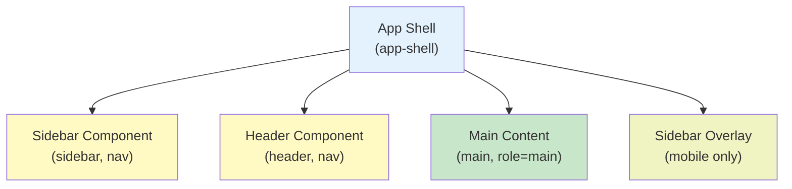

# ReidHub Frontend Guidelines

## Table of Contents
1. [Overview](#overview)
2. [CSS Architecture](#css-architecture)
3. [JavaScript Architecture](#javascript-architecture)
4. [Component Hierarchy](#component-hierarchy)
5. [Design Tokens & Variables](#design-tokens--variables)
6. [Styling Conventions](#styling-conventions)
7. [JavaScript Best Practices](#javascript-best-practices)
8. [Component Structure](#component-structure)
9. [Responsive Design Guidelines](#responsive-design-guidelines)
---

## Overview

ReidHub uses a **modular, feature-based frontend architecture** with vanilla CSS and JavaScript. The frontend is organized to support multiple modules (Marketplace, Community, Forum, etc.) while maintaining consistent design patterns and reusable components.

### Tech Stack
- **Markup**: PHP/HTML5
- **Styling**: Vanilla CSS3 (no preprocessor)
- **JavaScript**: ES6+ (Vanilla, no framework)
- **Fonts**: Poppins (Google Fonts)
- **Icons**: Custom SVG icons
- **Images**: WebP with PNG fallbacks

### Key Principles
- 📦 **Modularity** - Feature-based file organization
- 🎨 **Consistency** - Design tokens and reusable patterns
- 📱 **Responsive** - Mobile-first approach
- ⚡ **Performance** - Minimal dependencies, optimized assets
- ♿ **Accessibility** - WCAG 2.1 compliance
- 🧹 **Maintainability** - Clear naming conventions

---

## CSS Architecture

### Directory Structure

```
public/css/
├── app/
│   ├── globals.css              # Design tokens, resets, typography
│   ├── layout.css               # App shell, grid, flex layouts
│   ├── components/              # Reusable component styles
│   │   ├── header.css           # Top navigation bar
│   │   └── sidebar.css          # Left navigation panel
│   ├── admin/                   # Admin-specific styles
│   │   ├── admin-dashboard.css
│   │   ├── manage-marketplace.css
│   │   └── manage-users.css
│   ├── user/                    # User dashboard and features
│   │   ├── user-dashboard.css
│   │   ├── marketplace/         # Marketplace feature styles
│   │   │   ├── merch-store.css
│   │   │   ├── my-cart.css
│   │   │   ├── seller-portal-*.css
│   │   │   └── checkout.css
│   │   ├── community/           # Community feature styles
│   │   │   ├── community.css
│   │   │   ├── blogs.css
│   │   │   ├── clubs.css
│   │   │   ├── events.css
│   │   │   └── blog-view.css
│   │   ├── edu-forum/           # Forum feature styles
│   │   │   ├── all-questions.css
│   │   │   ├── one-question.css
│   │   │   └── add-question.css
│   │   └── lost-and-found/      # Lost & Found feature styles
│   │       ├── lost-and-found-items.css
│   │       ├── report-lost-item.css
│   │       └── report-found-item.css
├── auth/
│   ├── globals.css              # Auth page resets and typography
│   └── sign-up.css              # Sign-up page specific styles
└── home/
    ├── globals.css              # Home page base styles
    ├── navbar.css               # Public navigation bar
    ├── hero.css                 # Hero section
    └── aboutus.css              # About page styles
```

### CSS Organization Pattern

Each CSS file follows this structure:

```css
/* ==========================================================================
   1) Variables & Tokens
   ========================================================================== */
:root {
  --primary-color: #fff;
  --secondary-color: #0466C8;
  /* ... more tokens ... */
}

/* ==========================================================================
   2) Component/Section Title
   ========================================================================== */

/* Base element styling */
.component-name {
  /* ... styles ... */
}

/* Sub-components and variations */
.component-name__element {
  /* ... styles ... */
}

.component-name--variant {
  /* ... styles ... */
}

/* ==========================================================================
   3) Responsive Design (Mobile First)
   ========================================================================== */

@media (min-width: 768px) {
  /* tablet styles */
}

@media (min-width: 1024px) {
  /* desktop styles */
}

@media (min-width: 1440px) {
  /* large desktop styles */
}
```

### Design Tokens

ReidHub uses CSS custom properties for consistent styling across the application:

```css
/* Color Palette */
:root {
  --primary-color: #fff;          /* White */
  --secondary-color: #0466C8;     /* Blue */
  --ternary-color: #E8EDF5;       /* Light blue-grey */
  --accent-color: #0466C8;        /* Accent (blue) */
  --text-color: #222;             /* Dark grey text */
}

/* Text Hierarchy */
:root {
  --text-primary: #0F172A;        /* Headings, important text */
  --text-secondary: #475569;      /* Body text */
  --text-muted: #64748B;          /* Secondary text */
  --text-light: #94A3B8;          /* Tertiary/disabled text */
  --text-inverse: #FFFFFF;        /* Text on dark backgrounds */
}

/* Interactive Elements */
:root {
  --link-color: #0466C8;          /* Link default color */
  --link-hover: #1D4ED8;          /* Link hover color */
  --btn-primary-bg: #0466C8;      /* Button background */
  --btn-primary-hover: #1D4ED8;   /* Button hover state */
}

/* Surfaces & Backgrounds */
:root {
  --bg-page: #F8FAFC;             /* Page background */
  --surface: #FFFFFF;             /* Component background */
  --surface-elevated: #FFFFFF;    /* Elevated surfaces (cards) */
  --surface-subtle: #F1F5F9;      /* Subtle backgrounds */
  --surface-hover: #E2E8F0;       /* Hover state backgrounds */
}

/* Navigation */
:root {
  --sidebar-bg: #FFFFFF;          /* Sidebar background */
  --sidebar-border: #E2E8F0;      /* Sidebar border */
  --nav-active-bg: #EBF4FF;       /* Active nav item background */
  --nav-active-text: #1D4ED8;     /* Active nav item text */
  --nav-hover-bg: #F3F4F6;        /* Nav item hover background */
}

/* Typography */
:root {
  --heading-font: 'Poppins', Arial, sans-serif;
  --body-font: 'Poppins', Arial, sans-serif;
}

/* Layout & Spacing */
:root {
  --border-radius: 50px;          /* Default border radius */
  --card-shadow: 0 2px 8px rgba(0,0,0,0.08);
  --transition-fast: 0.2s;        /* Fast animation duration */
}
```

### Global Styles (`globals.css`)

The `globals.css` file establishes the foundation:

```css
/* 1) CSS Reset */
* {
  box-sizing: border-box;
  margin: 0;
  padding: 0;
}

/* 2) Typography Defaults */
body {
  font-family: var(--body-font);
  color: var(--text-color);
  min-height: 100vh;
}

h1, h2, h3, h4, h5, h6 {
  font-family: var(--heading-font);
  color: var(--text-primary);
}

/* 3) Link Styles */
a {
  color: var(--link-color);
  text-decoration: none;
  transition: color var(--transition-fast);
}

a:hover {
  color: var(--link-hover);
}

/* 4) Form Elements */
input, textarea, select {
  font-family: var(--body-font);
  border: 1px solid var(--sidebar-border);
  border-radius: 8px;
  padding: 8px 12px;
}

button {
  font-family: var(--heading-font);
  background-color: var(--btn-primary-bg);
  color: var(--text-inverse);
  border: none;
  border-radius: 8px;
  cursor: pointer;
  transition: background-color var(--transition-fast);
}

button:hover {
  background-color: var(--btn-primary-hover);
}
```

---

## JavaScript Architecture

### Directory Structure

```
public/js/
├── app/
│   ├── components/              # Shared component scripts
│   │   └── sidebar.js           # Sidebar toggle and navigation
│   ├── user-dashboard.js        # Dashboard initialization
│   ├── marketplace/             # Marketplace feature scripts
│   │   ├── my-cart.js
│   │   ├── seller-portal-orders.js
│   │   ├── seller-portal-edit-items.js
│   │   ├── show-product.js
│   │   └── merch-store.js
│   ├── community/               # Community feature scripts
│   │   ├── blogs.js
│   │   ├── blog-form.js
│   │   ├── blog-view.js
│   │   ├── clubs.js
│   │   ├── club-form.js
│   │   ├── club-view.js
│   │   ├── club-manage.js
│   │   ├── community.js
│   │   └── events.js
│   ├── edu-forum/               # Forum feature scripts
│   │   ├── all-questions.js
│   │   ├── one-question.js
│   │   └── add-question.js
│   └── lost-and-found/          # Lost & Found scripts
│       ├── lost-and-found-items.js
│       ├── report-lost-item.js
│       └── report-found-item.js
└── home/                        # Home page scripts
    └── animations/              # Animation utilities
```

### JavaScript Module Pattern

ReidHub uses ES6 classes with module pattern for organization:

```javascript
/**
 * Feature Name - Brief Description
 * 
 * Handles: [list of responsibilities]
 * Dependencies: [external APIs, DOM selectors]
 * Events: [custom or DOM events emitted]
 */
class FeatureName {
  constructor() {
    this.config = {
      apiEndpoint: '/api/feature',
      debounceDelay: 300,
      animationDuration: 200,
    };
    this.init();
  }

  init() {
    this.cacheDOM();
    this.bindEvents();
    this.render();
  }

  /**
   * Cache frequently accessed DOM elements
   * Improves performance by reducing DOM queries
   */
  cacheDOM() {
    this.el = {
      container: document.querySelector('.feature-container'),
      button: document.querySelector('.feature-btn'),
      list: document.querySelector('.feature-list'),
    };
  }

  /**
   * Bind event listeners
   * Always use arrow functions to preserve 'this' context
   */
  bindEvents() {
    if (this.el.button) {
      this.el.button.addEventListener('click', () => this.handleButtonClick());
    }

    this.el.container.addEventListener('change', (e) => {
      if (e.target.matches('.feature-input')) {
        this.handleInputChange(e);
      }
    });
  }

  /**
   * Fetch data from API
   * Use fetch API with error handling
   */
  async fetchData(endpoint) {
    try {
      const response = await fetch(endpoint);
      if (!response.ok) throw new Error(`HTTP ${response.status}`);
      return await response.json();
    } catch (error) {
      console.error('Fetch error:', error);
      this.showErrorMessage('Failed to load data');
      return null;
    }
  }

  /**
   * Render or update DOM
   */
  render() {
    // Update DOM elements
  }

  /**
   * Event handlers
   */
  handleButtonClick() {
    // Handle click event
  }

  handleInputChange(event) {
    // Handle input change
  }

  /**
   * Cleanup
   * Remove event listeners if component is destroyed
   */
  destroy() {
    this.el.button?.removeEventListener('click', this.handleButtonClick);
  }
}

// Initialize on DOM ready
document.addEventListener('DOMContentLoaded', () => {
  new FeatureName();
});
```

### Module Instantiation in Views

In PHP view files, initialize JavaScript modules:

```php
<!-- At the end of the view, before layout closes -->
<script type="module" src="/js/app/marketplace/my-cart.js"></script>
```

Or inline initialization for page-specific setup:

```php
<script type="module">
  import MyCart from '/js/app/marketplace/my-cart.js';
  
  document.addEventListener('DOMContentLoaded', () => {
    const cart = new MyCart({
      productId: <?= json_encode($productId) ?>,
      userId: <?= json_encode($userId) ?>
    });
  });
</script>
```

### User Dashboard Class Example

```javascript
class UserDashboard {
  constructor() {
    this.sidebarOpen = false;
    this.init();
  }

  init() {
    this.setupSearch();
    this.setupResponsiveSidebar();
    this.setupNotifications();
    this.setupImageLoading();
    this.setupAnimations();
    this.loadDynamicContent();
  }

  setupSearch() {
    const searchInput = document.querySelector('.search-input');
    const searchBtn = document.querySelector('.search-btn');

    if (searchInput) {
      searchInput.addEventListener('keypress', (e) => {
        if (e.key === 'Enter') {
          this.performSearch(searchInput.value);
        }
      });
    }
  }

  setupResponsiveSidebar() {
    if (window.innerWidth <= 1024) {
      this.createMobileMenuToggle();
    }
  }

  // ... other methods
}

// Auto-initialize
document.addEventListener('DOMContentLoaded', () => {
  new UserDashboard();
});
```

---

## Component Hierarchy

### Layout Components



### Component Nesting Structure

```
<body>
  <div class="app-shell">
    <!-- Navigation Components -->
    <aside class="sidebar" role="navigation">
      <nav class="sidebar-nav">
        <ul class="nav-list">
          <li><a href="/dashboard/user" class="nav-item nav-item--active">Dashboard</a></li>
          <li><a href="/dashboard/marketplace" class="nav-item">Marketplace</a></li>
          <li><a href="/dashboard/community" class="nav-item">Community</a></li>
          <!-- More items -->
        </ul>
      </nav>
    </aside>

    <header class="header" role="banner">
      <div class="header-content">
        <button class="header-menu-toggle" data-toggle="sidebar">☰</button>
        <div class="header-brand">ReidHub</div>
        <div class="header-user">
          
        </div>
      </div>
    </header>

    <!-- Main Content Area -->
    <main class="forum-main" role="main">
      <!-- Page-specific content rendered here -->
    </main>
  </div>

  <!-- Mobile Sidebar Overlay -->
  <div class="sidebar-overlay" data-sidebar-overlay aria-hidden="true"></div>
</body>
```

### Sidebar Navigation (`components/sidebar.php`)

```php
<aside class="sidebar" id="sidebar-panel" data-sidebar="panel">
  <nav class="sidebar-nav">
    <div class="nav-section">
      <div class="nav-section-title">Dashboard</div>
      <ul class="nav-list">
        <li class="nav-item<?= $current_page === 'dashboard' ? ' nav-item--active' : '' ?>">
          <a href="/dashboard/user" class="nav-link">📊 Dashboard</a>
        </li>
      </ul>
    </div>

    <div class="nav-section">
      <div class="nav-section-title">Marketplace</div>
      <ul class="nav-list">
        <li class="nav-item<?= $current_page === 'marketplace' ? ' nav-item--active' : '' ?>">
          <a href="/dashboard/marketplace/merch-store" class="nav-link">🛒 Merch Store</a>
        </li>
        <li class="nav-item">
          <a href="/dashboard/marketplace/my-cart" class="nav-link">🛒 My Cart</a>
        </li>
      </ul>
    </div>

    <!-- More sections: Community, Forum, Lost & Found -->
  </nav>
</aside>
```

### Header Component (`components/header.php`)

```php
<header class="header" role="banner">
  <div class="header-content">
    <!-- Mobile Menu Toggle -->
    <button class="header-menu-toggle" data-sidebar-toggle aria-label="Toggle sidebar">
      <span class="hamburger-icon">☰</span>
    </button>

    <!-- Brand -->
    <div class="header-brand">
      <a href="/" class="header-logo">ReidHub</a>
    </div>

    <!-- Search -->
    <div class="header-search">
      <input type="search" class="search-input" placeholder="Search...">
      <button class="search-btn">🔍</button>
    </div>

    <!-- User Menu -->
    <div class="header-user">
      " 
           alt="User Avatar" class="header-avatar">
      <div class="header-dropdown">
        <a href="/dashboard/user" class="dropdown-item">Profile</a>
        <a href="/logout" class="dropdown-item">Logout</a>
      </div>
    </div>
  </div>
</header>
```

---

## Styling Conventions

### Class Naming (BEM Methodology)

ReidHub uses **Block, Element, Modifier (BEM)** naming convention:

```
Block: .sidebar
Element: .sidebar__item, .sidebar__link
Modifier: .sidebar--open, .sidebar__item--active
```

**Example:**

```css
/* Block */
.marketplace-card {
  background: var(--surface);
  border-radius: 8px;
  padding: 16px;
}

/* Element */
.marketplace-card__title {
  font-size: 18px;
  font-weight: 600;
  color: var(--text-primary);
}

.marketplace-card__price {
  font-size: 24px;
  color: var(--secondary-color);
  font-weight: 700;
}

.marketplace-card__image {
  width: 100%;
  object-fit: cover;
  border-radius: 8px;
}

/* Modifier */
.marketplace-card--featured {
  border: 2px solid var(--secondary-color);
}

.marketplace-card__button--sold {
  background-color: var(--text-muted);
  cursor: not-allowed;
}
```

### Utility Classes

Common utility classes for quick styling:

```css
/* Display Utilities */
.hidden { display: none; }
.invisible { visibility: hidden; }
.block { display: block; }
.inline { display: inline; }
.inline-block { display: inline-block; }
.flex { display: flex; }
.grid { display: grid; }

/* Spacing Utilities */
.mt-1 { margin-top: 8px; }
.mt-2 { margin-top: 16px; }
.mt-3 { margin-top: 24px; }

.p-1 { padding: 8px; }
.p-2 { padding: 16px; }
.p-3 { padding: 24px; }

/* Text Utilities */
.text-center { text-align: center; }
.text-right { text-align: right; }
.font-bold { font-weight: 700; }
.text-muted { color: var(--text-muted); }
.text-primary { color: var(--text-primary); }

/* Opacity */
.opacity-50 { opacity: 0.5; }
.opacity-75 { opacity: 0.75; }

/* Hover & Interaction */
.cursor-pointer { cursor: pointer; }
.hover-opacity:hover { opacity: 0.9; }
```

---

## JavaScript Best Practices

### DOM Manipulation

```javascript
// ✅ Good: Cache DOM queries
class ListManager {
  constructor() {
    this.listContainer = document.querySelector('.list-container');
    this.items = this.listContainer.querySelectorAll('.list-item');
  }

  addItem(itemData) {
    const newItem = document.createElement('div');
    newItem.className = 'list-item';
    newItem.innerHTML = `<span>${itemData.text}</span>`;
    this.listContainer.appendChild(newItem);
  }
}

// ❌ Bad: Repeated DOM queries
class BadListManager {
  addItem(itemData) {
    document.querySelector('.list-container').appendChild(
      document.createElement('div')
    );
    document.querySelector('.list-item').innerHTML = itemData.text;
  }
}
```

### Event Delegation

```javascript
// ✅ Good: Use event delegation for dynamic elements
class TodoList {
  constructor() {
    this.container = document.querySelector('.todos');
    this.container.addEventListener('click', (e) => {
      if (e.target.matches('.todo-delete-btn')) {
        this.deleteTodo(e.target.closest('.todo'));
      }
      if (e.target.matches('.todo-edit-btn')) {
        this.editTodo(e.target.closest('.todo'));
      }
    });
  }

  deleteTodo(todoEl) {
    todoEl.remove();
  }
}

// ❌ Bad: Individual listeners on dynamic elements
class BadTodoList {
  addTodo(data) {
    const li = document.createElement('li');
    const deleteBtn = document.createElement('button');
    deleteBtn.addEventListener('click', () => li.remove()); // Repeated for each item
    li.appendChild(deleteBtn);
  }
}
```

### Async Operations

```javascript
// ✅ Good: Use async/await with error handling
class CartManager {
  async updateCartQuantity(itemId, quantity) {
    try {
      const response = await fetch('/api/cart/update', {
        method: 'POST',
        headers: { 'Content-Type': 'application/json' },
        body: JSON.stringify({ itemId, quantity })
      });

      if (!response.ok) throw new Error('Update failed');
      
      const data = await response.json();
      this.renderCart(data);
      this.showSuccessMessage('Cart updated');
    } catch (error) {
      console.error('Error updating cart:', error);
      this.showErrorMessage('Failed to update cart');
    }
  }
}

// ❌ Bad: Promise chains without error handling
class BadCartManager {
  updateCartQuantity(itemId, quantity) {
    fetch('/api/cart/update', {
      method: 'POST',
      body: JSON.stringify({ itemId, quantity })
    }).then(res => res.json())
     .then(data => this.renderCart(data));
  }
}
```

### Data Attributes

Use `data-*` attributes for element selection instead of classes:

```html
<!-- HTML -->
<button data-action="delete" data-item-id="123">Delete</button>
<div data-module="marketplace-filters"></div>

<script>
  // JavaScript
  const deleteBtn = document.querySelector('[data-action="delete"]');
  const cartContainer = document.querySelector('[data-module="marketplace-filters"]');
</script>
```

---

## Component Structure

### Creating a New Feature Component

When creating a new component, follow this structure:

**1. Create CSS file** (`public/css/app/[feature]/component-name.css`)

```css
/* ==========================================================================
   Component: Product Card
   Description: Displays marketplace product with image, title, price
   ========================================================================== */

.product-card {
  background: var(--surface);
  border-radius: 8px;
  overflow: hidden;
  box-shadow: var(--card-shadow);
  transition: transform var(--transition-fast);
}

.product-card:hover {
  transform: translateY(-4px);
  box-shadow: 0 4px 16px rgba(0,0,0,0.12);
}

.product-card__image {
  width: 100%;
  height: 200px;
  object-fit: cover;
  display: block;
}

.product-card__content {
  padding: 16px;
}

.product-card__title {
  font-size: 16px;
  font-weight: 600;
  color: var(--text-primary);
  margin-bottom: 8px;
}

.product-card__price {
  font-size: 18px;
  font-weight: 700;
  color: var(--secondary-color);
}

.product-card__button {
  width: 100%;
  padding: 8px;
  margin-top: 12px;
  background: var(--btn-primary-bg);
  color: white;
  border: none;
  border-radius: 4px;
  cursor: pointer;
  font-weight: 600;
}

.product-card__button:hover {
  background: var(--btn-primary-hover);
}

.product-card__button--disabled {
  background: var(--text-muted);
  cursor: not-allowed;
  opacity: 0.6;
}

/* Responsive */
@media (max-width: 768px) {
  .product-card__image {
    height: 150px;
  }

  .product-card__content {
    padding: 12px;
  }
}
```

**2. Create HTML/PHP template** (`app/views/[module]/component-name.php`)

```php
<div class="product-card" data-product-id="<?= $product['id'] ?>">
  " alt="<?= $product['title'] ?>" 
       class="product-card__image" loading="lazy">
  <div class="product-card__content">
    <h3 class="product-card__title"><?= htmlspecialchars($product['title']) ?></h3>
    <p class="product-card__price">₹<?= number_format($product['price'], 2) ?></p>
    <button class="product-card__button" data-action="add-to-cart">
      Add to Cart
    </button>
  </div>
</div>
```

**3. Create JavaScript controller** (`public/js/app/[feature]/component-name.js`)

```javascript
/**
 * Product Card Component
 * Handles: Add to cart, wish list, image loading
 */
class ProductCard {
  constructor(element) {
    this.el = element;
    this.productId = element.dataset.productId;
    this.init();
  }

  init() {
    this.setupImageLoading();
    this.bindEvents();
  }

  setupImageLoading() {
    const img = this.el.querySelector('img');
    img.addEventListener('load', () => this.el.classList.add('loaded'));
  }

  bindEvents() {
    this.el.querySelector('[data-action="add-to-cart"]')
      ?.addEventListener('click', () => this.addToCart());
  }

  async addToCart() {
    try {
      const response = await fetch('/api/cart/add', {
        method: 'POST',
        headers: { 'Content-Type': 'application/json' },
        body: JSON.stringify({ productId: this.productId })
      });

      const data = await response.json();
      if (data.success) {
        this.showNotification('Added to cart');
      }
    } catch (error) {
      console.error('Error adding to cart:', error);
    }
  }

  showNotification(message) {
    // Show toast notification
  }
}

// Initialize all product cards
document.addEventListener('DOMContentLoaded', () => {
  document.querySelectorAll('[data-product-id]').forEach(el => {
    new ProductCard(el);
  });
});
```

**4. Include in layout**

Add CSS in `layout.php` head:
```php
<link rel="stylesheet" href="/css/app/marketplace/product-card.css">
```

Include script at end of layout or view:
```php
<script type="module" src="/js/app/marketplace/product-card.js"></script>
```

---

## Responsive Design Guidelines

### Breakpoints

ReidHub uses mobile-first breakpoints:

```css
/* Mobile (default) */
/* ... mobile styles ... */

/* Tablet and up */
@media (min-width: 768px) {
  /* tablet styles */
}

/* Desktop and up */
@media (min-width: 1024px) {
  /* desktop styles */
}

/* Large desktop */
@media (min-width: 1440px) {
  /* large desktop styles */
}
```

### Responsive Layout Pattern

```css
.grid-container {
  display: grid;
  grid-template-columns: 1fr;           /* Mobile: 1 column */
  gap: 16px;
}

@media (min-width: 768px) {
  .grid-container {
    grid-template-columns: 1fr 1fr;     /* Tablet: 2 columns */
    gap: 24px;
  }
}

@media (min-width: 1024px) {
  .grid-container {
    grid-template-columns: 1fr 1fr 1fr; /* Desktop: 3 columns */
    gap: 32px;
  }
}
```

### Responsive Images

```html
<!-- Use srcset for responsive images -->


<!-- Use picture element for format variations -->
<picture>
  <source srcset="/images/product.webp" type="image/webp">
  <source srcset="/images/product.png" type="image/png">
  
</picture>
```

---
